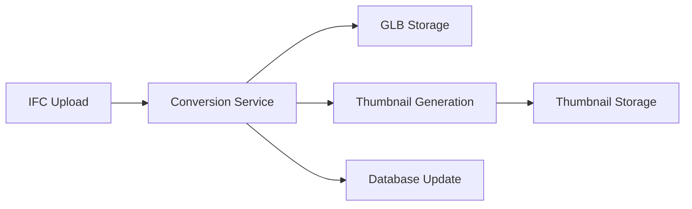

# GLB Conversion Service

## Deployment

1. Build the Docker image:
```bash
docker build -t glb-converter .
```

2. Run the container:
```bash
docker run -d \
  -p 3001:3001 \
  -e SUPABASE_URL=your_url \
  -e SUPABASE_KEY=your_key \
  --name glb-converter \
  glb-converter
```

## Required Environment Variables

```
SUPABASE_URL=your_supabase_url
SUPABASE_KEY=your_supabase_key
```

## API Endpoints

- `POST /convert` - Trigger IFC to GLB conversion
  - Body: `{ ifcPath: string, projectId: string }`
  - Returns: `{ success: boolean, glbUrl?: string }`

## Architecture


